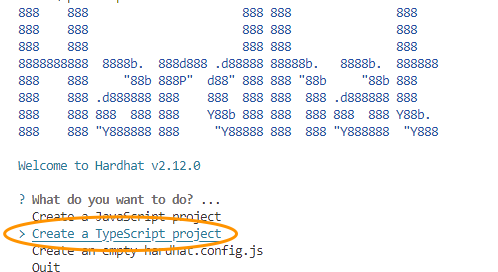

# Exercise 1 - Intro to Web3/Smart Contract Development with Hardhat, Ethereum and Solidity

If you came here to learn about modern smart contract development, you're at the right spot. In this exercise, you will learn how to install and use the latest and most up-to-date tools with the help of a simple starter project.

## Creating and exploring an new Hardhat project

Open Visual Code

TODO Screenshot

Open Terminal

TODO Screenshot

To get started with Hardhat, please create a new `ap260` folder and open this folder in the Visual Studio Code Terminal:

```shell
mkdir ap260
cd ap260
```

Next, let's create a new NodeJs project:

```shell
npm init -y
```

Now, we will install Hardhat as a developer dependency to our project:

```shell
npm install hardhat --save-dev
```

### Create a Hardhat project

Once this finishes, create a Hardhat project:

```shell
npx hardhat
```

This will open following dialog in Terminal:



Select and answer the questions as followed:

- What do you want to do? **Create a TypeScript project**
- Hardhat project root: **Accept the default**
- Do you want to add a .gitignore? **Y**

Et voilà - you just created your first Hardhat sample project. Take a look around before we continue.

### Install Hardhat Toolbox

The Hardhat Toolbox plugin contains e.g. the test framowork for our sample project. You need to install it as following:

```shell
npm install @nomicfoundation/hardhat-toolbox --save-dev
```

## Compiling your first sample smart contract

This Hardhat sample project comes with a default smart contract, which is in the `contracts/` directory and the full path is `contracts/Lock.sol`. The contract is quite simple and only allows the owner to lock a certain amount of Ether (Ethereum's native cryptocurrency) before it can be withdrawn.

Let's check if we can compile our `Lock.sol` sample contract:

```shell
npx hardhat compile
```

The above command will attempt to compile all smart contracts in the `contracts` directory. Once the command finishes, you will see the the message "Compled 1 Solidity file successfully" and an `artifacts` directory is created. Feel free to take a look at the generated artifacts.

## Running tests for a smart contract

Next we will check that our testing infrastructure is up and running. The sample project comes with a test for the `Lock.sol` smart contract. Tests are in the `test` directory: check `test/Lock.ts`

Notice that tests are written in [TypeScript](https://en.wikipedia.org/wiki/TypeScript) and smart contracts in [Solidity](https://en.wikipedia.org/wiki/Solidity).

We're not yet diving into details and simply want to check our testing setup works:

```shell
npx hardhat test
```

The above will run all tests in the `test` directory.


Before we conclude this basic "get to know Hardhat" part, we will deploy the compiled smart contract. At this point, we will not use the live, public Ethereum mainnet or one of the testnets, but we will use a local, single node Ethereum network, which Hardhat is providing to us.

## Deploying the sample contract to a local Hardhat test network

You will notice a deployment script for the `Lock.sol` smart contract in the `scripts`  folder called `deploy.ts`. It uses the TypeScript variant of ethers.js, a well-known Ethereum JavaScript library.

This script calculates the current timestamp (in seconds) and the unlock time which will be one year in the future:

```typescript
  const currentTimestampInSeconds = Math.round(Date.now() / 1000);
  const ONE_YEAR_IN_SECS = 365 * 24 * 60 * 60;
  const unlockTime = currentTimestampInSeconds + ONE_YEAR_IN_SECS;
```

It will then call the function parseEther to get the amount of 1 Ether in WEI (the smallest part of an Ether) for the locked amount:

```typescript
const lockedAmount = ethers.utils.parseEther("1");
```

And finally it deploys the _Lock_ contract to the network. **Note: The test script uses a local Hardhat testnet blockchain network.**

```typescript
  const Lock = await ethers.getContractFactory("Lock");
  const lock = await Lock.deploy(unlockTime, { value: lockedAmount });

  await lock.deployed();
```

 Let's run it - and don't worry, the local Hardhat network resets each time if you run the following command:

```shell
npx hardhat run scripts/deploy.ts
```

You should get a printout for the deployment address of the contract.


## Summary

Congratulations, you made it through the first exercise! You have successfully used Hardhat, one of the best and most current Ethereum development environments out there. With the help of the Hardhat sample project, you have compiled, tested and even deployed a smart contract. Now that you have a basic understanding of how things are rolling, let's dive into the world of NFTs.

Continue to - [Exercise 2 - Diving into the world of NFTs](../ex2/README.md)
