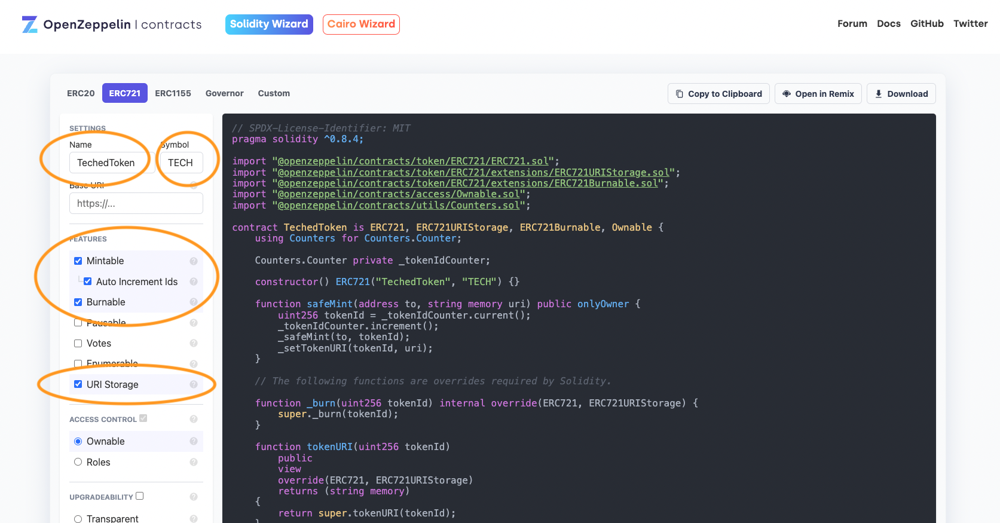
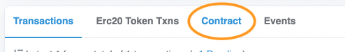
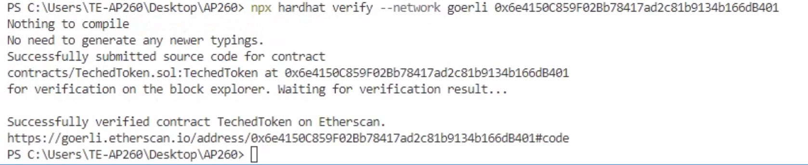
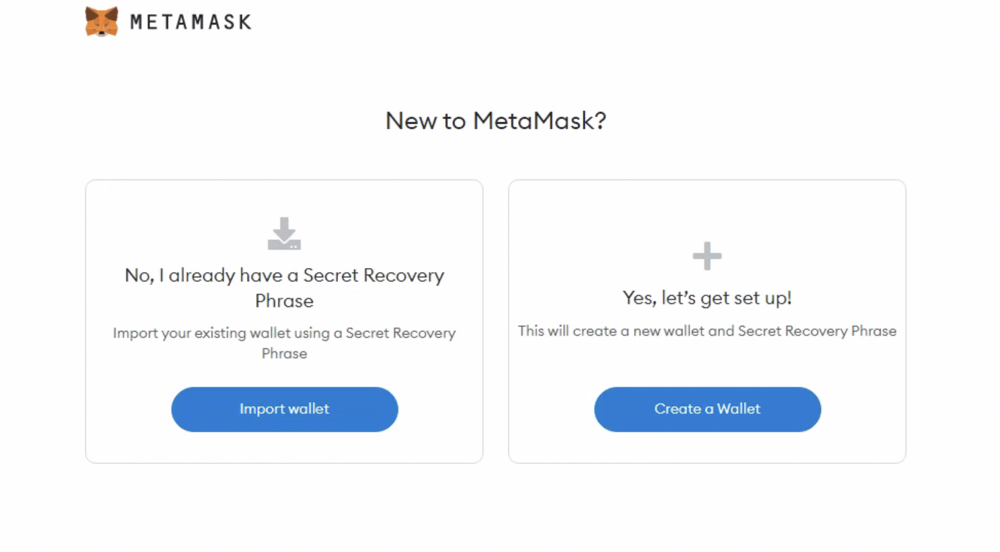
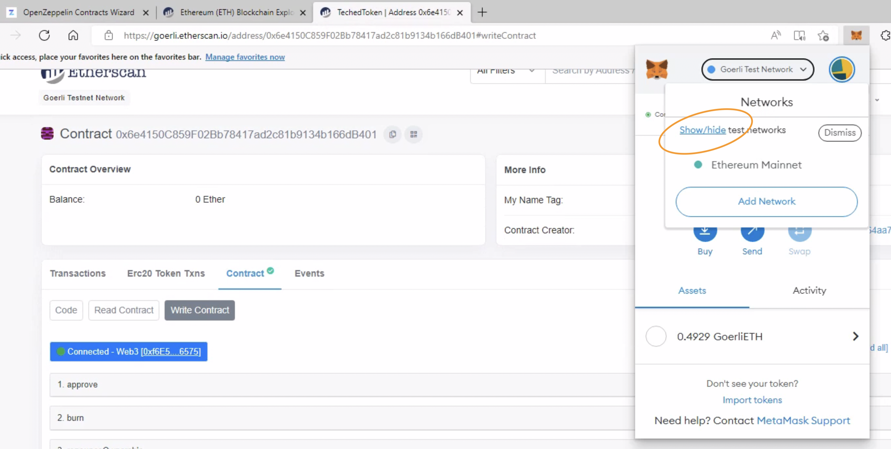
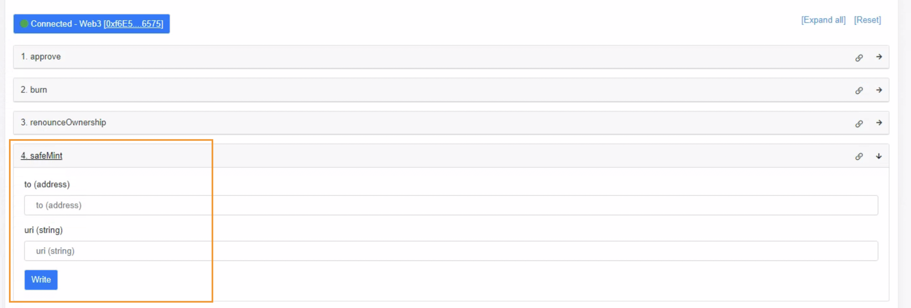

# Exercise 2 - Diving into the world of NFTs

We're now ready to dive into the world of NFTs. On Ethereum, NFTs are represented via smart contracts, interacted with via the contract's functions and the uniqueness of an NFT is guaranteed by state kept on a public blockchain. By the end of this exercise, you will have deployed your own NFT smart contract to a public testnet and you will be able to check out your NFT on OpenSea's Testnet. 

Ready? Let's go! (the more you get involved with crypto, chances are that you will soon write LFG!!! - it means "let's f$%^ go!"). 

### Creating a new NFT contract
To create an NFT, you will first have to deploy a smart contract with adheres to the ERC-721 standard. You can see a full list of required functions [here](http://erc721.org/).  While we could start from scratch with an almost empty `.sol` File, we'll not re-invent the wheel here. Instead, we will make use of the excellent [OpenZeppelin smart contract wizard, which we kindly ask you to open in your browser now](https://wizard.openzeppelin.com/).OpenZeppelin contracts is a library of community-reviewed smart contracts.

Let's configure a new ERC-721 smart contract:

- Switch to the ERC721 tab in the wizard
- Your're free to choose a token name and symbol, but don't forget to change these names later in the code. To keep things simple, we recommend to choose `TechedToken` as the name and  `TECH` as the symbol. 
- We don't need a base URI for our fist NFT smart contract... keep the field empty.
- For features, choose `mintable` and `auto increment ids`. As owners of this future deployed contract, we want to be able to mint new NFTs and the internal uninque TokenID shall be automatically incremented.
- Please also enable `burnable` to enable token holders to destroy their tokens and `uri storage` to be able to specify fresh metadata for each NFT that gets minted.
- For the remaining settings, just keep the defaults. 



Click the `Copy to clipboard` button and switch to Visual Studio Code. Here, in the `contracts` folder, create a new file called `TechedToken.sol` and copy over the contents. 

## Compiling the new TechedToken smart contract

We'll now immediately try to compile the new contract:

```
npx hardhat compile
```

Whoa, what's happening? Do you also see some errors? It seems we forgot to include OpenZeppeli contracts to our hardhat development environment. Let's fix that:

```
npm install @openzeppelin/contracts --save-dev
```

Now try compiling again - `npx hardhat compile` and hardhat should happily find all imports. 

## Adding a deployment script for the TechedToken smart contract

As we want to deploy our compiled contract, we have to create another deployment script. In the `scripts` folder, create a new `deployTeched.ts` TypeScript file. The content is very similar to the default deployment script, but of course we reference our new contract:

```
import { ethers } from "hardhat";

async function main() {
  const [deployer] = await ethers.getSigners();
  console.log("Deploying contracts with the account:", deployer.address);
  console.log("Account balance:", (await deployer.getBalance()).toString());

  //make sure to sue the correct Token name for the ContractFactory!
  const TechedToken = await ethers.getContractFactory("TechedToken");
  const techedToken = await TechedToken.deploy();

  await techedToken.deployed();

  console.log(`TechedToken deployed to  ${techedToken.address}`);
}

// We recommend this pattern to be able to use async/await everywhere
// and properly handle errors.
main().catch((error) => {
  console.error(error);
  process.exitCode = 1;
});
```
At the beginning of the deployment script, we have added a few log outputs. They will help you to understand what's going on. Via `getSigners()` we're accessing the account which deploys the smart contract. We're also printing the public address of that account and the current balance, which might be useful for trouble-shooting. 

We're now ready to deploy (still to our local hardhat network), let's try that:

```
npx hardhat run scripts/deployTeched.ts
```

All good? Then let's add a new network to our hardhat configuration to be able to deploy to a public ethereum testnet. The one we have chosen is the Goerli testnet. 

To add this network to our hardhat configuration, please open the file `hardhat.config.ts` and add the network configuration for `Goerli` - just copy the code below. We will next discuss a few things we need to change in this file.

```
import { HardhatUserConfig } from "hardhat/config";
import "@nomicfoundation/hardhat-toolbox";

const GOERLI_PRIVATE_KEY = "xxx";
const ALCHEMY_KEY = "xxx"

const config: HardhatUserConfig = {
  solidity: "0.8.17",
  networks: {
    goerli: {
      url: `https://eth-goerli.g.alchemy.com/v2/${ALCHEMY_KEY}`,
      accounts: [GOERLI_PRIVATE_KEY]
    }
  }
};

export default config;
```

There are two important changes you need to make to the above template:
- GOERLI_PRIVATE_KEY: you need your own, funded ethereum account to be able to deploy to a live network. This is why we prepped a couple of accounts and funded them with test either just for this workshop. 
- ALCHEMY_KEY: deploying to a public network requires access to a network node. Alchemy is one of the well-known providers of Ethereum network nodes and you will be able to use an existing API key to get access to Ethereum via their nodes.

DO THIS: Lookup your table ID and then check with the workshop owners to download and lookup the information above. Once you have your private key and the Alchemy API key, replace `xxx` in the `hardhat.config.ts` file with this information. If you're here on your own outside of a workshop, create accounts with the mentioned services and obtain API keys. 

Ready? 

```
npx hardhat run scripts/deployTeched.ts --network goerli
```

If all went well, you have now successfully deplpoyed your first NFT smart contract to the Goerli testnet. 

**Please take note of the contract address that is printed in the logs.**
**Please take note of the contract address that is printed in the logs.**
**Please take note of the contract address that is printed in the logs.**

## Using Etherscan and Verifying your contract

Oh, by the way:

**Please take note of the contract address that is printed in the logs.**

At this point you have deployed the NFT smart contract, but you have not yet created a single NFT. To create an NFT, we'll have to interact with the functions of the smart contract. While we could do this from ethers.js and our hardhat dev environment, we want to show you another neat way to interact with contracts: the etherscan explorer.

Open a browser and navigate to [goerli.etherscan.io](https://goerli.etherscan.io/). In the big search bar, type type the address of the contract you took note of earlier. Once the page has loaded, click the `Contract` tab which is a bit below. 



Bummer. You will now see the compile contract, which is not really fun to interact with. The trick is called verification. We will now verify our newly deployed smart contract and then be able to interact with the smart contract via the etherscan.io web interface. 

As verification is a service of etherscan, you would normally require another API key for their API. Luckily, you will find a ready to use etherscan API key in the same download as with the account private key and the Alchemy API key. 

DO THIS: check for the etherscan API key and then add these lines with the correct key to the `hardhat.config.ts` file:

```
  etherscan: {
    apiKey: "ETHERSCAN API KEY HERE",
  },
```

Verification is now a piece of cake - but you have to remember the contract address:

```
npx hardhat verify --network goerli <contract address>
```



If this went well, refresh the tab in the web browser - you should be able to see the read/write sections and you're now ready to interact with the live contract... almost!

## Installing MetaMask

By default, your browser is not able to send transaction to an ethereum (test) node. For this to happen, we need to install the MetaMask wallet which in combination with a library called web3.js (it's used by etherscan.io on their web pages) is able to send our transactions to the network.

DO THIS: Visit [metamask.io](https://metamask.io/) and click the download button. Follow the steps to install MetaMask as a browser plugin. Next, click the MetaMask plugin (top right in the browser and in the add-ons section) and choose to restore your wallet. You will find the seed phrase/words in the same download as before. This will import the same account used in the deployment script into your MetaMask wallet in the browser. If you are outside of a workshop environment, you will have to create a new wallet or use an existing wallet to continue. It's important to import and use the same private key that you previously added to the `hardhat.config.ts` file. 



As we are using the Goerli test network, please now switch the network used for MetaMask via the top drop down box to the Goerli Test Network. For this, you need to enable the test networks by clicking the "Show/hide test networks". 



## Creating a first NFT via the EtherScan contract explorer and MetaMask

Once MetaMask is ready, reload the etherscan.io page with your smart contract. In the bottom tab, be sure to have switched to Contract (which now has the green verification check mark) and click on `Write Contract` to see the write functions of your smart contract. Next, click `Connect to Web3`. This will pop up the MetaMask plugin and will need to confirm the connection to this web page. 

We will next create our first NFT by calling the safeMint function - click on safeMint in the function list on etherscan.io. This function requires two inputs: 

- to: the address the NFT should be owned by
- uri: a link to the metadata of the NFT



To mint your first NFT, let's choose your public address (look it up via MetaMask) for the `to` field. For the uri to the MetaData, you can choose this IPFS link, which we have prepared beforehand: `TODO ipfs://sdfasdfdasfasdfsdf`.

Click the `Write` button and confirm the transaction via MetaMask. Now check the transaction and it's status by using the link just next to the `Write` button. 

## Checking your NFT via the OpenSea Marketplace

At this point, you are now able to verify that all went well by using one of the public NFT marketplaces such as Opensea.io. As we have used the Goerli Ethereum testnet, we'll have to switch to the testnet version of Opensea.io, too - which is [testnets.opensea.io](https://testnets.opensea.io/). Search for your smart contract... with a bit of luck (and time, it often takes a few minutes) you will be able to find your fresh NFT on OpenSea.

## Summary

This part of the workshop was quite intense. If you've never worked with NFTs and smart contracts before, you will have learned quite a bit. We started with the configuration of a fresh ERC-721 smart contract, which we then compiled and deployed not only to a local testnet, but to the live Ethereum Goerli testnet. From there, we used the popular Etherscan web site in combination with the MetaMask wallet to interact with our smart contract: we created a first NFT! Finally, we verified it all via OpenSea, one of the most known NFT marketplaces out there.

Still with us? Ready for more smart contract development? Let's take this one step further and discuss how we can add real utility to our ERC-721 NFT smart contract.

Continue to - [Exercise 3 - Adding utility to your smart contracts](../ex3/README.md)
