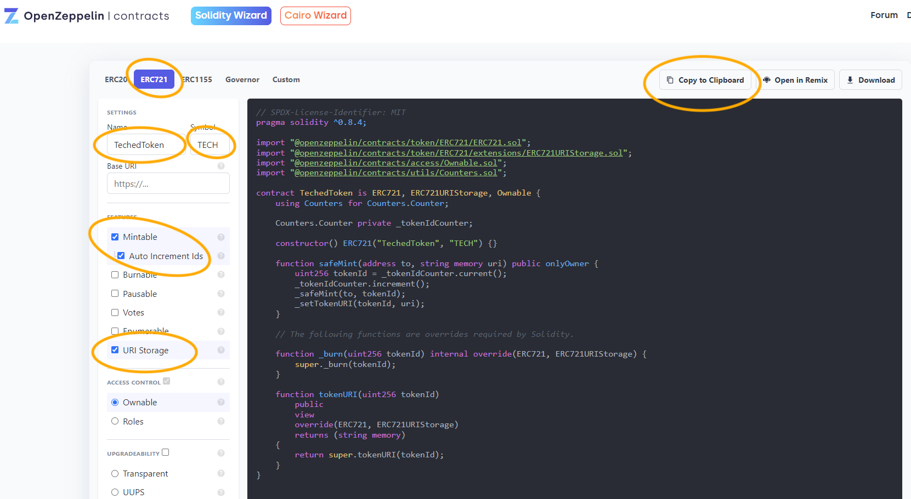
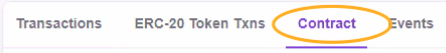
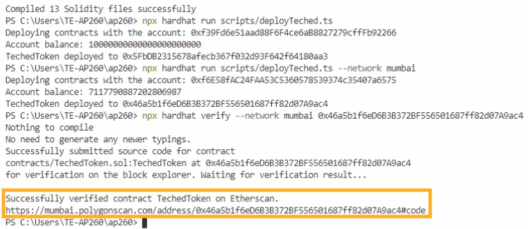
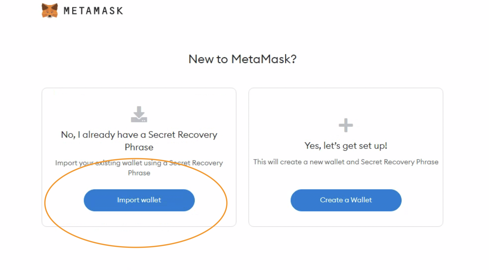

# Exercise 2 - Diving into the world of NFTs

We're now ready to dive into the world of NFTs. On Ethereum, NFTs are represented via smart contracts, interacted with via the contract's functions and the uniqueness of an NFT is guaranteed by state kept on a public blockchain. By the end of this exercise, you will have deployed your own NFT smart contract to a public testnet blockchain and you will be able see your NFT on OpenSea.

Ready? Let's go! (the more you get involved with crypto, chances are that you will soon write LFG!!! - it means "let's f$%^ go!").

## Creating a new NFT contract

To create an NFT, you will first have to deploy a smart contract with adheres to the ERC-721 standard. You can see a full list of required functions [here](http://erc721.org/).  While we could start from scratch with an almost empty `.sol` file, we'll not re-invent the wheel here.

Instead, we will make use of the excellent [OpenZeppelin smart contract wizard](https://wizard.openzeppelin.com/), which we kindly ask you to open in your browser now. OpenZeppelin contracts is a library of community-reviewed smart contracts.

### Wizard OpenZeppelin

Let's configure a new ERC-721 smart contract:

- Open the [OpenZeppelin wizard](https://wizard.openzeppelin.com/) in your browser.
- In the wizard change the tab to ERC721.
- To keep things simple, we recommend to choose `TechedToken` as the name and  `TECH` as the symbol.
- Select following features:

  - `Mintable` - our NFT should be mintable
  - `Auto Increment Ids` - the internal uninque TokenID shall be automatically incremented.
  - `URI Storage` - to be able to specify for each NFT own metadata



### Create a new Smart Contract

To create a new smart contract:

- At the wizard click the button `Copy to Clipboard` button.
- Switch to Visual Studio Code and create in the `contracts` folder a new file called `TechedToken.sol`.
- Paste the copied content from the OpenZepplin Wizard in the new file.
- **... and don't forget to save your file.**

## Compiling the new TechedToken smart contract

We'll now immediately try to compile the new contract:

```shell
npx hardhat compile
```

Whoa, what's happening? Do you also see some errors? It seems we forgot to include the OpenZeppelin contract libraries to our Hardhat development environment. Let's fix that:

```shell
npm install @openzeppelin/contracts --save-dev
```

Now try to compile again:

```shell
npx hardhat compile
```

Hardhat should happily find all imports and compile 13 Solidity files. These are our new smart contrat and the imported OpenZeppelin contract libraries.

## Adding a deployment script for the TechedToken smart contract

As we want to deploy our compiled contract, we have to create another deployment script. In the `scripts` folder, create a new `deployTeched.ts` TypeScript file. The content is very similar to the default deployment script, but of course we reference our new contract:

```typescript
import { ethers } from "hardhat";

async function main() {
  const [deployer] = await ethers.getSigners();
  console.log("Deploying contracts with the account:", deployer.address);
  console.log("Account balance:", (await deployer.getBalance()).toString());

  // make sure to sue the correct Token name for the ContractFactory!
  const TechedToken = await ethers.getContractFactory("TechedToken");
  const techedToken = await TechedToken.deploy();

  await techedToken.deployed();

  console.log(`TechedToken deployed to ${techedToken.address}`);
}

// We recommend this pattern to be able to use async/await everywhere
// and properly handle errors.
main().catch((error) => {
  console.error(error);
  process.exitCode = 1;
});
```

At the beginning of the deployment script, we have added a few log outputs. They will help you to understand what's going on. Via `getSigners()` we're accessing the account which deploys the smart contract. We're also printing the public address of that account and the current balance, which might be useful for trouble-shooting.

We're now ready to deploy the smart contrat to the local Hardhat network. Let's try that:

```shell
npx hardhat run scripts/deployTeched.ts
```

All good? Then let's add a new network to our Hardhat configuration to be able to deploy to a public Ethereum testnet. The one we have chosen is the Goerli Ethereum testnet.

To add this network to our Hardhat configuration, please open the file `hardhat.config.ts` and add the network configuration for `Goerli` - just copy the code below. We will next discuss a few things we need to change in this file.

```typescript
import { HardhatUserConfig } from "hardhat/config";
import "@nomicfoundation/hardhat-toolbox";

const GOERLI_PRIVATE_KEY = "xxx";
const ALCHEMY_KEY = "xxx";
const ETHERSCAN_KEY = "xxx";

const config: HardhatUserConfig = {
  solidity: "0.8.17",
  networks: {
    goerli: {
      url: `https://eth-goerli.g.alchemy.com/v2/${ALCHEMY_KEY}`,
      accounts: [GOERLI_PRIVATE_KEY],
    }
  },
  etherscan: {
    apiKey: ETHERSCAN_KEY,
  },
};

export default config;
```

There are two **important** changes you need to make to the above template:

- GOERLI_PRIVATE_KEY - you need your own, funded ethereum account to be able to deploy to a live network. This is why we prepped a couple of accounts and funded them with test Goerli Ether just for this workshop.
- ALCHEMY_KEY - deploying to a public network requires access to a network node. Alchemy is one of the well-known providers of Ethereum network nodes and you will be able to use an existing API key to get access to Ethereum via their nodes.
- ETHERSCAN_KEY - see below.

**ACTION REQUIRED**:

- Lookup your table ID.
- Check with the workshop owners to download and lookup the information above.
- Once you have your private key and the Alchemy API key, replace `xxx` in the `hardhat.config.ts` file with this information.
- If you're here on your own outside of a workshop, create accounts with the mentioned services and obtain API keys.

Ready?

```shell
npx hardhat run scripts/deployTeched.ts --network goerli
```

If all went well, you have now successfully deplpoyed your first NFT smart contract to the Goerli testnet.

**Please take note of the contract address that is printed in the logs.**
**Please take note of the contract address that is printed in the logs.**
**Please take note of the contract address that is printed in the logs.**

## Etherscan verifies your smart contract

Oh, by the way:

**Please take note of the contract address that is printed in the logs.**

At this point you have deployed the NFT smart contract, but you have not yet created a single NFT. To create an NFT, we'll have to interact with the functions of the smart contract. While we could do this from ethers.js and our Hardhat dev environment, we want to show you another neat way to interact with contracts: the Etherscan Explorer.

Open a browser and navigate to [goerli.etherscan.io](https://goerli.etherscan.io/). In the big search bar, type the address of the contract you took note of earlier. Once the page has loaded, click the `Contract` tab which is a bit below.



Bummer. You will now see the compile contract, which is not really fun to interact with. The trick is called verification. We will now let Etherscan verify our newly deployed smart contract. Then we are able to interact with the smart contract with the Etherscan Explorer web interface.

### Verification Process

Etherscan offers a verification service. Therefore, the smart contract code is uploaded to Etherscan, compiled and verified. This also allows Etherscan to offer an interface to communicate with the smart contract.

You would normally require an Etherscan API key. Luckily, we prepared one for you and you will find it in the same download as the other keys.

**ACTION REQUIRED**:

- Check for the Etherscan API key.
- In the `hardhat.config.ts` file replace the 'xxx' string with the Etherscan API key.

Verification is now a piece of cake - but you have to remember the contract address:

```shell
npx hardhat verify --network goerli <contract address>
```



If this went well, refresh the tab in the web browser. The Contract tab shows a check mark and you should be able to see the Read Contract and Write Contract sections. You are now ready to interact with the live contract... almost!

## Installing MetaMask

By default, your browser is not able to send transaction to an Ethereum (test) node. For this to happen, we need to install the MetaMask wallet which in combination with a library called web3.js (it's used by etherscan.io on their web pages) is able to send our transactions to the network.

**DO THIS**:

- Visit [metamask.io](https://metamask.io/).
- Click the download button.
- Follow the steps to install MetaMask as a browser plugin.
- Next, click the MetaMask plugin (top right in the browser and in the add-ons section) and choose **Import wallet** to restore your wallet.
- You will find the secret recovery prase in the same download as before. This will import the account which you used in the deployment script into your MetaMask wallet.
- If you are outside of a workshop environment, you will have to create a new wallet or use an existing wallet to continue.

It's **important** to import and use the same private key that you previously added to the `hardhat.config.ts` file.



As we are using the Goerli test network, please now switch the network used for MetaMask via the top drop down box to the Goerli Test Network. For this, you need to enable the test networks by clicking the **Show/hide test networks**.


## Creating a first NFT with the EtherScan Explorer and MetaMask

Once MetaMask is ready, reload the etherscan.io page with your smart contract. In the bottom tab, be sure to have switched to Contract (which now has the green verification check mark) and click on `Write Contract` to see the write functions of your smart contract. Next, click `Connect to Web3`. This will pop up the MetaMask plugin and will need to confirm the connection to this web page.

We will next create our first NFT by calling the safeMint function - click on safeMint in the function list on etherscan.io. This function requires two inputs:

- to: the address the NFT should be owned by
- uri: a link to the metadata of the NFT


To mint your first NFT, let's choose your public address (look it up via MetaMask) for the `to` field. For the `uri` (for the metadata), you can use the following [IPFS](https://en.wikipedia.org/wiki/InterPlanetary_File_System) link, which we have prepared beforehand:

```text
ipfs://bafkreifbyh6ekzouvhs43hrlyxoibtrkpqqp2ttjcbm5tailauzsds6bwu
```

Click on the button `Write` and confirm the transaction via MetaMask. Now check the transaction and it's status by clicking on the button `View your transaction`.

<details>
  <summary>sample metadata file</summary>

```json
{
  "name": "SAP TechEd 2022 Las Vegas",
  "description": "AP260 - Beyond Just an NFT: Unlocking Utility in Smart Contracts",
  "image": "ipfs://bafkreicmr6leblcbb6sc26rtj6ttfy7gq3gqq6pxlo5pdi57qbfm7mtmda",
  "attributes": [
    {
      "trait_type": "Type",
      "value": "Value"
    }
  ]
}
```

The image is also stored on an IPFS system.
</details>

## Checking your NFT via the OpenSea Marketplace

At this point, you are now able to verify that all went well by using one of the public NFT marketplaces such as OpenSea. As we have used the Goerli Ethereum testnet, we have to switch to [testnets.opensea.io](https://testnets.opensea.io/). Search for your **contract address** ... with a bit of luck (and time, it often takes a few minutes) you will be able to find your fresh minted NFT on OpenSea.

## Summary

This part of the workshop was quite intense. If you've never worked with NFTs and smart contracts before, you have learned quite a lot. We started with the configuration of an ERC-721 smart contract, which we then compiled and deployed not only to a local testnet, but also to the live Ethereum Goerli testnet. From there, we verified our smart contract and used Etherscan in combination with the MetaMask wallet to interact with our smart contract: **You have created your first NFT!** Finally, we verified it all with OpenSea, one of the most known NFT marketplaces out there.

Still with us? Ready for more smart contract development? Let's take this one step further and discuss how we can add real utility to our ERC-721 NFT smart contract.

Continue to - [Exercise 3 - Adding utility to your smart contracts](../ex3/README.md)
